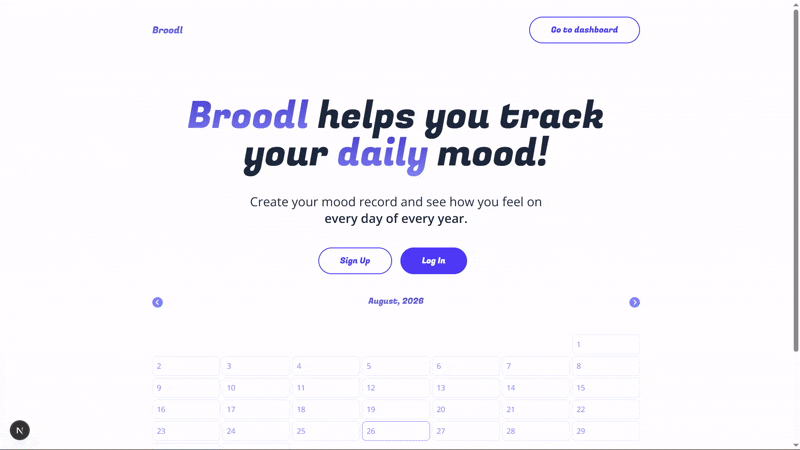

# Hi there 👋 
## I'm Luke, a Full Stack Software Engineer. 
### I enjoy building things, solving problems, and seeing ideas come to life.

## About Me
I'm currently working as a freelance web developer, building websites and full-stack applications.

With a background in psychology, I bring a user-focused and analytical approach to development. I work primarily with JavaScript, React and Node.js, building full-stack applications and responsive web experiences.

🤝 Now accepting new clients, see my portfolio at <a href="https://built-by-luke.netlify.app">Builty-By-Luke.com</a>

## Skill Stack

---

## Projects

<table>
  <tr>
    <td align="center" width="33%">
      
       
      <b>Chilworth Village Hall</b> 
      A Vanilla JS web app for the Chilworth Village Hall</a>
       
      Tags: HTML, CSS, JS
    </td>
    <td align="center" width="33%">
      
       
      <b>Caffiend</b> 
      A coffee tracking app w. React.JS, FantaCSS & Firebase. 
       
      Tags: React.JS, FantaCSS, Firebase
    </td>
    <td align="center" width="33%">
      
       
      <b>broodl</b> 
      A mood tracking app w. Next.JS, Tailwind & Firebase. 
       
      Tags: Next JS, Tailwind, Firebase
    </td>
  </tr>
</table>

---

## Links

